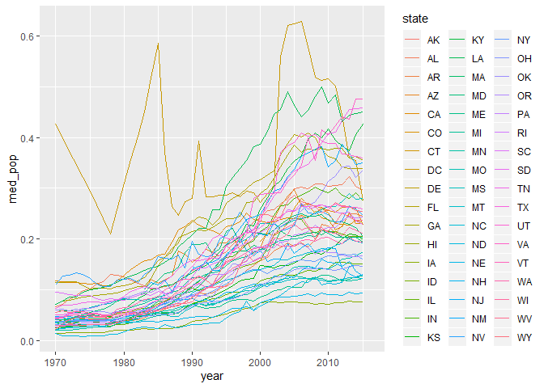
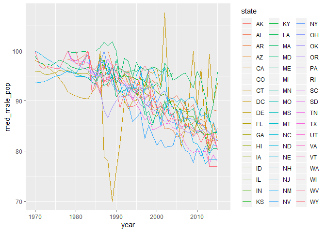
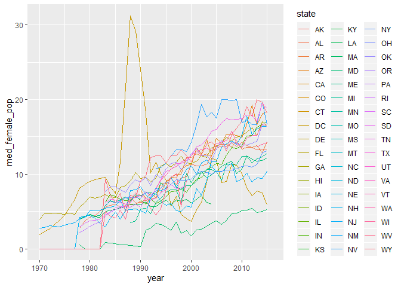
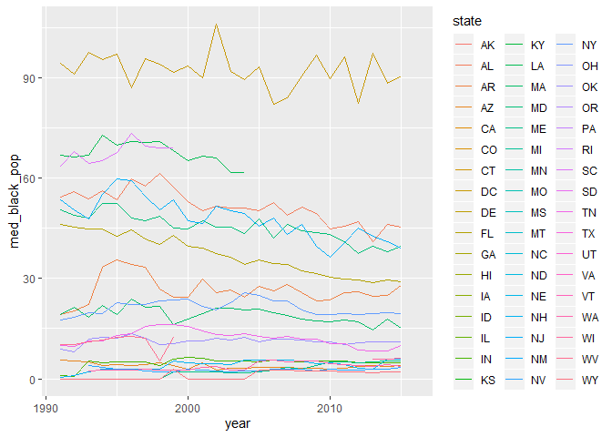
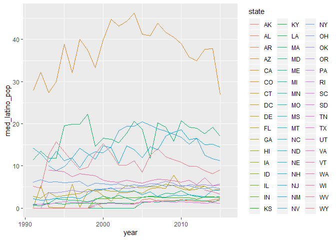
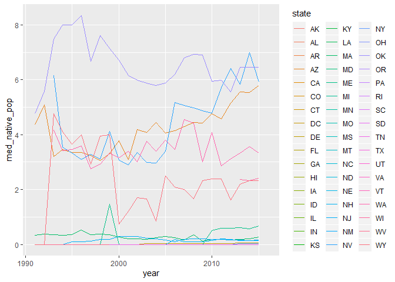
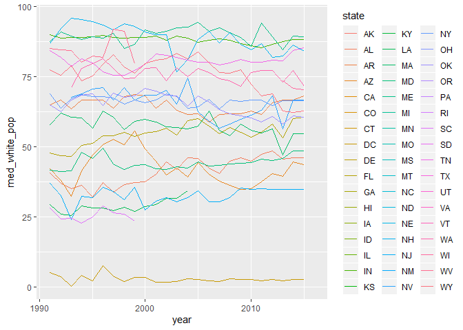
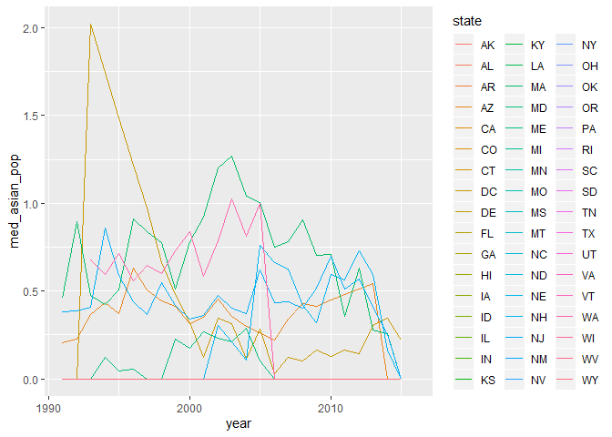

### Loading tidyverse et les données

```r
library(tidyverse)
```
# Données sur la population des prisons aux États-Unis

```r
prison <- readr::read_csv("https://raw.githubusercontent.com/rfordatascience/tidytuesday/master/data/2019/2019-01-22/incarceration_trends.csv")
```

```
## Parsed with column specification:
## cols(
##   .default = col_double(),
##   state = col_character(),
##   county_name = col_character(),
##   urbanicity = col_character(),
##   region = col_character(),
##   division = col_character()
## )
```

```
## See spec(...) for full column specifications.
```

```r
head(prison)
```

```
## # A tibble: 6 x 79
##    yfips  year  fips state county_name total_pop total_pop_15to64
##    <dbl> <dbl> <dbl> <chr> <chr>           <dbl>            <dbl>
## 1 1.97e8  1970  1001 AL    Autauga Co~     24661            14154
## 2 1.97e8  1971  1001 AL    Autauga Co~     25503            14765
## 3 1.97e8  1972  1001 AL    Autauga Co~     27156            15939
## 4 1.97e8  1973  1001 AL    Autauga Co~     28453            16906
## 5 1.97e8  1974  1001 AL    Autauga Co~     29261            17578
## 6 1.98e8  1975  1001 AL    Autauga Co~     29716            18007
## # ... with 72 more variables: female_pop_15to64 <dbl>,
## #   male_pop_15to64 <dbl>, asian_pop_15to64 <dbl>, black_pop_15to64 <dbl>,
## #   latino_pop_15to64 <dbl>, native_pop_15to64 <dbl>,
## #   other_pop_15to64 <dbl>, white_pop_15to64 <dbl>, urbanicity <chr>,
## #   region <chr>, division <chr>, commuting_zone <dbl>, metro_area <dbl>,
## #   land_area <dbl>, total_jail_adm <dbl>, total_jail_adm_dcrp <dbl>,
## #   female_jail_adm_dcrp <dbl>, male_jail_adm_dcrp <dbl>,
## #   total_jail_pop <dbl>, female_jail_pop <dbl>, male_jail_pop <dbl>,
## #   asian_jail_pop <dbl>, black_jail_pop <dbl>, latino_jail_pop <dbl>,
## #   native_jail_pop <dbl>, white_jail_pop <dbl>,
## #   total_jail_pretrial <dbl>, female_jail_pretrial <dbl>,
## #   male_jail_pretrial <dbl>, jail_from_state_prison <dbl>,
## #   jail_from_other_state_prison <dbl>, jail_from_state_jail <dbl>,
## #   jail_from_other_state_jail <dbl>, jail_from_fed <dbl>,
## #   jail_from_ice <dbl>, total_jail_pop_dcrp <dbl>,
## #   female_jail_pop_dcrp <dbl>, male_jail_pop_dcrp <dbl>,
## #   total_prison_pop <dbl>, female_prison_pop <dbl>,
## #   male_prison_pop <dbl>, asian_prison_pop <dbl>, black_prison_pop <dbl>,
## #   latino_prison_pop <dbl>, native_prison_pop <dbl>,
## #   other_prison_pop <dbl>, white_prison_pop <dbl>,
## #   total_prison_adm <dbl>, female_prison_adm <dbl>,
## #   male_prison_adm <dbl>, asian_prison_adm <dbl>, black_prison_adm <dbl>,
## #   latino_prison_adm <dbl>, native_prison_adm <dbl>,
## #   other_prison_adm <dbl>, white_prison_adm <dbl>, num_facilites <dbl>,
## #   num_employees <dbl>, confined_pop <dbl>, capacity <dbl>,
## #   ucr_population <dbl>, index_crime <dbl>, violent_crime <dbl>,
## #   property_crime <dbl>, murder_crime <dbl>, rape_crime <dbl>,
## #   robbery_crime <dbl>, agr_assault_crime <dbl>, burglary_crime <dbl>,
## #   larceny_crime <dbl>, mv_theft_crime <dbl>, arson_crime <dbl>
```

### Pourcentage de population relative en prison

```r
prison %>%
  mutate(relative_jail_pop = total_jail_pop/total_pop*100) %>%
  select(year, state, county_name, total_pop, total_jail_pop, relative_jail_pop) %>%
  arrange(desc(relative_jail_pop))
```

```
## # A tibble: 147,533 x 6
##     year state county_name        total_pop total_jail_pop relative_jail_p~
##    <dbl> <chr> <chr>                  <dbl>          <dbl>            <dbl>
##  1  1978 MO    Ste. Genevieve Co~         0            2              Inf  
##  2  1979 MO    Ste. Genevieve Co~         0            3              Inf  
##  3  2007 TX    King County              284           50.1             17.6
##  4  2007 TX    Dickens County          2461          423.              17.2
##  5  2004 TX    Reeves County          12721         2153               16.9
##  6  2006 TX    Dickens County          2466          413.              16.7
##  7  2006 TX    King County              285           46.4             16.3
##  8  2003 TX    Reeves County          12910         2085               16.2
##  9  2002 TX    Reeves County          13017         1998               15.3
## 10  2010 LA    East Carroll Pari~      7759         1178               15.2
## # ... with 147,523 more rows
```

### Population relative en prison à travers les années

```r
prison %>%
  group_by(state, year) %>%
  mutate(relative_jail_pop = total_jail_pop/total_pop*100) %>%
  summarise(med_pop = median(relative_jail_pop)) %>%
  ggplot(aes(x=year, y=med_pop, colour=state)) +
    geom_line()
```

```
## Warning: Removed 457 rows containing missing values (geom_path).
```

<!-- -->

### Population relative d'hommes en prison à travers les années

```r
prison %>%
  group_by(state, year) %>%
  mutate(relative_male_jail_pop = male_jail_pop/total_jail_pop*100) %>%
  summarise(med_male_pop = median(relative_male_jail_pop)) %>%
  ggplot(aes(x=year, y=med_male_pop, colour=state)) +
    geom_line()
```

```
## Warning: Removed 1698 rows containing missing values (geom_path).
```

<!-- -->

### Population relative de femmes en prison à travers les années

```r
prison %>%
  group_by(state, year) %>%
  mutate(relative_female_jail_pop = female_jail_pop/total_jail_pop*100) %>%
  summarise(med_female_pop = median(relative_female_jail_pop)) %>%
  ggplot(aes(x=year, y=med_female_pop, colour=state)) +
    geom_line()
```

```
## Warning: Removed 1706 rows containing missing values (geom_path).
```

<!-- -->

### Population relative de personnes noires en prison à travers les années

```r
#On peut voir que les données sont incomplètes
prison %>%
  filter(year>1990) %>% #Aucune données avant 1990
  group_by(state, year) %>%
  mutate(relative_black_jail_pop = black_jail_pop/total_jail_pop*100) %>%
  summarise(med_black_pop = median(relative_black_jail_pop)) %>%
  ggplot(aes(x=year, y=med_black_pop, colour=state)) +
    geom_line()
```

```
## Warning: Removed 870 rows containing missing values (geom_path).
```

<!-- -->

### Population relative de personnes latino en prison à travers les années

```r
prison %>%
  group_by(state, year) %>%
  filter(year>1990) %>% #Aucune données avant 1990
  mutate(relative_latino_jail_pop = latino_jail_pop/total_jail_pop*100) %>%
  summarise(med_latino_pop = median(relative_latino_jail_pop)) %>%
  ggplot(aes(x=year, y=med_latino_pop, colour=state)) +
    geom_line()
```

```
## Warning: Removed 870 rows containing missing values (geom_path).
```

<!-- -->

### Population relative de personnes natives en prison à travers les années

```r
#Manque beaucoup de données
prison %>%
  group_by(state, year) %>%
  filter(year>1990) %>% #Aucune données avant 1990
  mutate(relative_native_jail_pop = native_jail_pop/total_jail_pop*100) %>%
  summarise(med_native_pop = median(relative_native_jail_pop)) %>%
  ggplot(aes(x=year, y=med_native_pop, colour=state)) +
    geom_line()
```

```
## Warning: Removed 870 rows containing missing values (geom_path).
```

<!-- -->

### Population relative de personnes blanches en prison à travers les années

```r
prison %>%
  group_by(state, year) %>%
  filter(year>1990) %>% #Aucune données avant 1990
  mutate(relative_white_jail_pop = white_jail_pop/total_jail_pop*100) %>%
  summarise(med_white_pop = median(relative_white_jail_pop)) %>%
  ggplot(aes(x=year, y=med_white_pop, colour=state)) +
    geom_line()
```

```
## Warning: Removed 870 rows containing missing values (geom_path).
```

<!-- -->

### Population relative de personnes asiatiques en prison à travers les années

```r
prison %>%
  #Manque aussi beaucoup de données
  group_by(state, year) %>%
  filter(year>1990) %>% #Aucune données avant 1990
  mutate(relative_asian_jail_pop = asian_jail_pop/total_jail_pop*100) %>%
  summarise(med_asian_pop = median(relative_asian_jail_pop)) %>%
  ggplot(aes(x=year, y=med_asian_pop, colour=state)) +
    geom_line()
```

```
## Warning: Removed 870 rows containing missing values (geom_path).
```

<!-- -->

